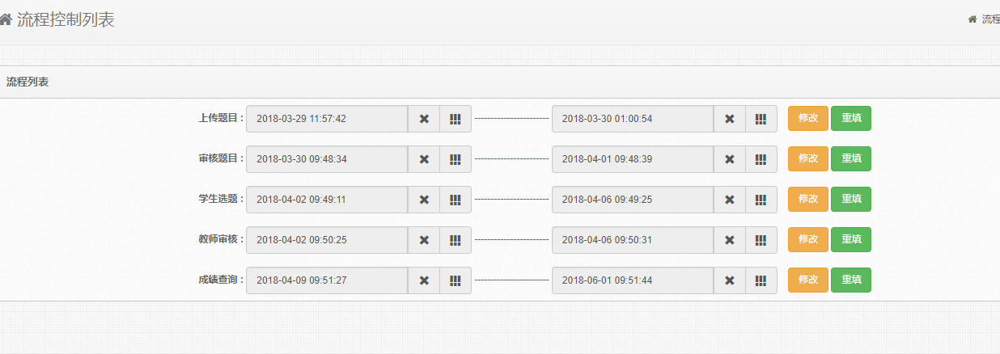

# 商洛学院毕业论文选题系统说明


|修改日期|修改人|修改人邮箱|版本|修改日志|  
|---|---|---|---|---|  
|2018.03.05|郑其龙|zhengql@senthink.com|1.0.0|初始化说明文档|    
|2018.04.12|郑其龙|zhengql@senthink.com|1.0.1|添加部分模块说明|  
***

<span id = "0000"></span> 
##  **目录**  
- [全局说明](#1001)
- [论文介绍](#2001)
- [项目技术](#3001)
- [项目模块](#4001)
     1. [登录](#4002)  
     1. [bug管理](#4003)  
     1. [个人信息](#4004)  
     1. [首页](#4005)  
     1. [专业系别](#4006)  
     1. [学生](#4007)  
     1. [教师](#4008)  
     1. [论文](#4009)  
     1. [选题](#4010)  
     1. [历届题目](#4011)  
     1. [统计报表](#4012)  
     1. [成绩上传](#4013)  
     1. [流程控制](#4014)  
     1. [成绩比例](#4015)
     1. [在线预览](#4016) 
     1. [注销](#4017)
- [数据库设计](#5001)
     1. [用户表](#5002)  
     1. [论文题目表](#5003)  
     1. [选题记录表](#5004)  
     1. [系别表](#5005)  
     1. [学生表](#5006)  
     1. [流程控制表](#5007)    
     1. [成绩比例表](#5007)  
     1. [bug记录表](#5007)   
***
<br/><br/><br/><br/><br/><br/><br/><br/><br/><br/><br/><br/>
<span id = "1001"></span> 
##  全局说明
1. 进度说明：  
   
1. 项目git地址 ： [点击进入（说明文档+项目代码）](https://github.com/zhengqilong/select#%E8%AE%BA%E6%96%87%E4%BB%8B%E7%BB%8D)  

1. 项目说明 ：  
```
项目目前处于 "测试+总结" 阶段，总体进度完成90%，预计在5月中旬完成。    
目前部分模块大部分功能已经实现，且流程顺利。
目前三种用户角色间已经可以实现论文选题的整套流程。
现阶段进行项目的bug测试和修复。
```

***
<span id = "2001"></span> 
## 论文介绍
```
结合毕业班毕业论文选题流程，设计并实现收集教师选题  
管理员审核题目、学生选题、教师审核选题、管理中间文档，
提交毕业论文等功能，力求投入校园使用。  
```


<span id = "3001"></span> 
## 项目技术
```
目前项目有两个版本分别使用不同的架构
选题系统(SSM)v1.0:
开发环境：idea+java8+mysql   
Java语言、Mysql数据库、Tomcat服务器、Jsp语言、bootstrap  
框架：MybatisPlus+Spring+SpringMvc 
位置：master分支 
  
选题系统(SpringBoot)v2.0:
开发环境：idea+java8+mysql+redis+openOffice   
Java语言、Mysql数据库、Tomcat服务器、Jsp语言、bootstrap  
框架：MybatisPlus+SpringBoot
位置：boot分支
``` 


<span id = "4001"></span> 
## 项目模块
模块名 | 具体业务 | 所属角色 | 完成情况
---|---|---|---
登录 | 登录模块 | 超管、管理员、教师、学生 | `完成`
bug | bug信息管理 | 超管、管理员、教师、学生 | `供测试阶段使用`
首页 | 首页信息展示 | 超管、管理员、教师、学生 | `完成`
个人信息 | 个人信息管理 | 超管、管理员、教师、学生 | `完成`
系别专业 | 系别专业管理 | 超管、管理员、教师 | `完成`
学生 | 学生信息管理 | 超管、管理员、教师、学生 | `完成`
教师 | 教师信息管理 | 超管、管理员、教师、学生 | `完成`
论文 | 论文信息管理 | 超管、管理员、教师、学生 | `完成`
选题 | 选题信息管理 | 超管、管理员、教师、学生 |`完成`
历届题目 | 历届题目信息 | 超管、管理员、教师、学生 |`完成`
报表统计 | 报表统计管理 | 超管、管理员、教师 | `完成`
成绩上传 | 成绩上传评分 | 超管、管理员、教师 | `完成`
成绩查看 | 成绩查看 | 学生 | `完成`
流程控制 | 流程控制管理 | 超管、管理员 | `完成`
成绩比例 | 成绩比例管理 | 超管、管理员 | `完成`
在线预览 | 题目相关文档在线预览 | 超管、管理员、教师、学生 | `完成`
注销 | 用户注销 | 超管、管理员、教师、学生 | `完成`
其他模块 |  |  | `待定`  
***


<span id = "4002"></span> 
### 登录
     
```
 根据登录用户的角色跳转到相应的页面
```
***


<span id = "4003"></span> 
### bug管理
     
```
 用户测试期间发现bug并提交、页面显示近十条bug提交记录  
```
***


<span id = "4004"></span> 
### 个人信息管理:
    
    
  - 管理员列表：（`超管、管理员`）
    - 启用禁用：(`超管权限`) 
    - 编辑删除：(`超管权限`) 
    - 批量删除：(`超管权限`) 
    - 添加新管理员：(`超管权限`) 
  - 我的信息：`个人信息编辑`
***


<span id = "4005"></span> 
### 首页
```
 展示公共信息页面  
```
***


<span id = "4006"></span> 
### 系别专业:
     
  - 系别  
    - 系别列表:  
    - 系别启用禁用:`存在启用专业时，不可禁用/存在启用教师时不可禁用`   
    - 系别添加、删除、批量删除：`存在专业时，不可删除/存在教师不可删除/存在题目不可删除`    
    - 系别查看、编辑：`系别名修改，所有相关用户的系别名也修改`    
  - 专业
    - 专业列表
    - 专业启用禁用：`存在学生，不可禁用/系别禁用不可启用`
    - 专业添加、删除、批量删除：`存在学生不可删除/存在选题记录不可删除`
    - 专业查看、编辑：`专业下班级数量修改，判断学生所在班级大小区间,专业名修改，所有相关用户的专业名也修改`    
  
***


<span id = "4007"></span> 
### 学生:
   
  - 学生列表：
  - 参数查询学生列表：      
  - 学生启用禁用：`存在未完成选题记录，不可禁用/所属专业禁用时，不可启用`
  - 添加学生：    
  - 编辑学生：   
  - 学生批量删除、批量添加、模板下载：`删除该学生记录和所有选题记录`      
***


<span id = "4008"></span> 
### 教师:
   
  - 教师列表：
  - 参数查询教师列表：     
  - 教师启用禁用：`有题目记录不可禁用/系别禁用时教师不可启用`   
  - 添加教师：  
  - 编辑教师：   
  - 教师详情：   
  - 教师批量删除、批量添加、模板下载：`删除该教师信息和所有题目信息`    
***  

<span id = "4009"></span> 
### 论文（`管理员`）:
     
   
  - 待审核列表：
    - 参数查询待审核列表：      
    - 审核论文：`需要说明原因`    
    - 批量审核通过：  
    - 论文详情：   
  - 已审核列表：
    - 参数查询已审核列表：      
    - 审核通过未通过的论文：`需要说明原因 `  
    - 论文详情：   

### 论文（`教师`）: 
    
    
  - 我的题目列表：
    - 参数查询我的题目列表：    
    - 论文题目添加：    
    - 论文题目详情：  
  - 已通过列表（`待选论文`）：
    - 参数查询已通过列表：        
    - 论文详情：       

### 论文（`学生`）: 
    
  - 待选题目列表：
  - 参数查询待选题目列表：        
  - 论文题目详情：  
  - 学生选题：`修改论文状态，添加选题记录`       
    
***


<span id = "4010"></span> 
### 选题（`管理员+教师`）:
   
  - 全部选题信息列表：
  - 参数查询选题信息列表：     
  - 题目详情：   
  
### 选题（`教师`）:
   
  - 待审核选题列表：
  - 参数查询带待审核选题信息列表：     
  - 选题详情：   
  - 审核通过：   
  - 审核不通过：`说明原因`    

### 选题（`学生`）:
   
  - 已选题目列表：    
  - 选题详情： 
  - 删除未通过记录去重选：`待完成`     
  
***


<span id = "4011"></span> 
### 历届题目信息:
    
  - 历届题目信息列表：`超管、管理员：可查看所有历届信息，教师：查看所在系别历届信息，学生：查看所在专业历届信息`
  - 参数查询历届题目信息列表：       
  - 历届题目信息详情：   
  - 导出报表：  
***  


<span id = "4012"></span> 
### 报表统计:
    
  - 题目列表：`超管、管理员：可查看所有历届信息，教师：查看所在系别历届信息，学生：查看所在专业历届信息`
    - 参数查询题目列表：     
    - 题目详情：    
    - 导出报表：  
  - 选题列表：`超管、管理员：可查看所有历届信息，教师：查看所在系别历届信息，学生：查看所在专业历届信息`
    - 参数查询选题列表：     
    - 选题详情：    
    - 导出报表：  
  - 成绩列表：`超管、管理员：可查看所有历届信息，教师：查看所在系别历届信息，学生：查看所在专业历届信息`
    - 参数查询成绩列表：     
    - 成绩详情：    
    - 导出报表：      
***  


<span id = "4013"></span> 
### 成绩上传:（`超管、管理员、教师`）  
    
  - 待评分列表：
  - 参数查询列表：     
  - 评分：`教师：指导老师评分，超管、管理员：评阅打分、答辩打分`
  - 详情：  
### 成绩查看:（`学生`）  
    
  - 成绩查看：   
***  


<span id = "4014"></span> 
### 流程控制管理:（`超管`）
    
```
设置上传题目 、审核题目、学生选题、教师审核、成绩查询流程的开放时间
```
***  


<span id = "4015"></span> 
### 成绩比例划分:（`超管`）
    
```
设置最终学生毕业设计总分的计算规则
```
***  


<span id = "4016"></span> 
### 文档预览:
    
```
题目相关的文档在线预览
```
***  

<span id = "4017"></span> 
### 注销:
```
用户退出登录、跳出到登录页面
```
***  

<span id = "5001"></span> 
## 数据库设计:  
<span id = "5002"></span> 
### 用户表（`select_user_base`）:  
字段名 | 注释 | 类型 | 初始值
---------|----------|---------|---------
 `id` | 用户id | int | 
 `user_code` | 账号 | varchar |
 `user_password` | 密码 | varchar |
 `user_name` | 姓名 | varchar |
 `user_sex` | 性别 1男，2女 | int |
 `user_mail` | 邮箱 | varchar |
 `user_phone` | 电话 | varchar |
 `user_qq` | QQ | varchar |
 `stu_major_id` | 学生专业ID | int | 
 `stu_class` | 学生班级 | int |
 `stu_year` | 学生届别 | varchar |
 `tea_position` | 教师职称 1教授，2副教授，3讲师，4助教 | int |
 `tea_major_name` | 教师专业名称 | varchar |
 `tea_education` | 教师学历 1博士，2硕士，3本科 | int |
 `tea_direction` | 教师研究方向 | varchar |
 `tea_dep_id` | 教师所属系别ID | int |
 `tea_info` | 教师个人简介 | varchar |
 `user_status` | 用户状态 0禁用，1启用 | int | 1
 `user_type` | 用户类型 1管理员，2教师，3学生 | int |
 `operator_id` | 操作人员id | int |
 `gmt_create` | 创建时间 | datetime |
 `gmt_modify` | 修改时间 | timestamp |CURRENT_TIMESTAMP
***

<span id = "5003"></span> 
### 论文题目表(`select_subject`):  
字段名 | 注释 | 类型 | 初始值
---------|----------|---------|---------
 `id` | 题目id | int | 
 `sub_name` | 题目名称 | int | 
 `tea_id` | 发布教师id | int |  
 `sub_type` | 题目类型，1应用型，2理论性 | int |  
 `sub_content` | 题目内容 | varchar |  
 `sub_select_status` | 题目选题状态 0未选 1审核中 2已选 | int | 0 
 `adm_audit_state` | 审核状态 0未处理，1审核不通过，2审核通过 | int | 0 
 `adm_audit_content` | 审核意见 | text |  
 `adm_audit_id` | 审核人id | int |  
 `tutor_score` | 指导老师评分 | int | 0
 `judge_score` | 评阅老师评分 | int | 0 
 `defence_score` | 答辩得分 | int | 0 
 `final_total_score` | 最终总得分 | int | 0 
 `for_dep_id` | 题目面向系别 | int |  
 `sub_year` | 题目年份 | varchar |  
 `gmt_create` | 创建时间 | datetime |
 `gmt_modify` | 修改时间 | timestamp |CURRENT_TIMESTAMP
***

<span id = "5004"></span> 
### 选题记录表(`select_topic`):  
字段名 | 注释 | 类型 | 初始值
---------|----------|---------|---------
 `id` | 选题id | int | 
 `sub_id` | 题目id | int | 
 `tea_id` | 教师id | int | 
 `stu_id` | 学生id | int | 
 `stu_select_reason` | 学生选择理由 | text | 
 `tea_audit_state` | 教师审核状态 0待处理 1审核不通过2审核通过 | int | 0 
 `tea_audit_content` | 教师审核理由 | text | 
 `topic_year` | 选题年份 | varchar | 
 `gmt_create` | 创建时间 | datetime |
 `gmt_modify` | 修改时间 | timestamp |CURRENT_TIMESTAMP
***


<span id = "5005"></span> 
### 系别表(`select_department`):  
字段名 | 注释 | 类型 | 初始值
---------|----------|---------|---------
 `id` | 系别id | int | 
 `dep_name` | 系别名称 | varchar | 
 `dep_info` | 系别介绍 | text | 
 `dep_status` | 系别状态 0禁用，1启用 | int | 1
 `gmt_create` | 创建时间 | datetime |
 `gmt_modify` | 修改时间 | timestamp |CURRENT_TIMESTAMP
***

<span id = "5006"></span> 
### 专业表(`select_major`):  
字段名 | 注释 | 类型 | 初始值
---------|----------|---------|---------
 `id` | 专业id | int | 
 `maj_name` | 专业名称 | varchar | 
 `dep_id` | 所属系别 | int | 
 `maj_class_num` | 专业班级数 | int | 
 `maj_status` | 专业状态 0禁用，1启用 | int | 1
 `maj_info` | 专业介绍 | text | 
 `gmt_create` | 创建时间 | datetime |
 `gmt_modify` | 修改时间 | timestamp |CURRENT_TIMESTAMP
***

<span id = "5007"></span> 
### 流程控制表(`select_process_control`):  
字段名 | 注释 | 类型 | 初始值
---------|----------|---------|---------
 `id` | 流程id | int | 
 `pro_name` | 流程名称 | varchar | 
 `pro_start_time` | 流程开始时间 | datetime | 
 `pro_end_time` | 流程结束时间 | datetime | 
 `gmt_create` | 创建时间 | datetime |
 `gmt_modify` | 修改时间 | timestamp |CURRENT_TIMESTAMP
***


<span id = "5008"></span> 
### 成绩比例表(`select_score_per`):  
字段名 | 注释 | 类型 | 初始值
---------|----------|---------|---------
 `id` | 流程id | int | 
 `score_name` | 成绩模块 | varchar | 
 `score_per` | 成绩所占百分比 | datetime | 
 `gmt_create` | 创建时间 | datetime | 
 `gmt_modify` | 修改时间 | timestamp |
***


<span id = "5009"></span> 
### bug记录表(`select_bug_log`):  
字段名 | 注释 | 类型 | 初始值
---------|----------|---------|---------
 `id` | bugid | int | 
 `user_id` | 用户id | int | 
 `bug_title` | bug标题 | varchar | 
 `bug_content` | bug内容 | text | 
 `gmt_create` | 创建时间 | datetime |
***